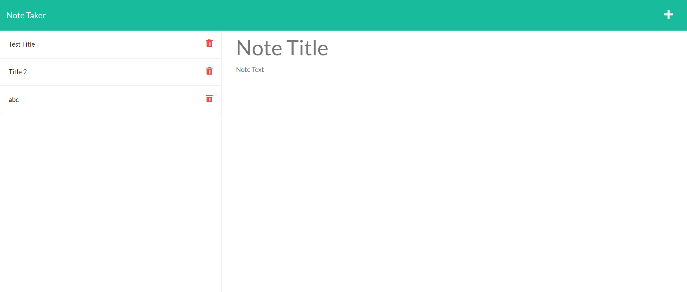
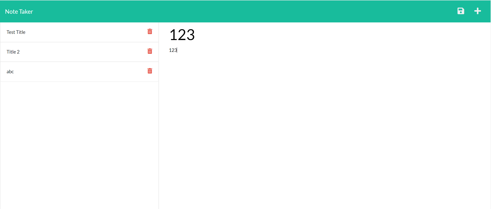
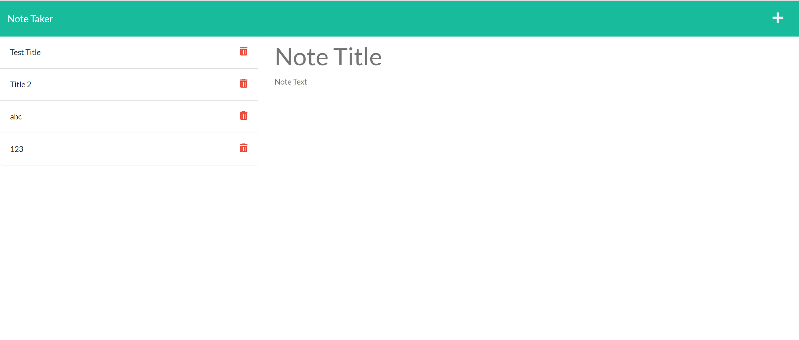
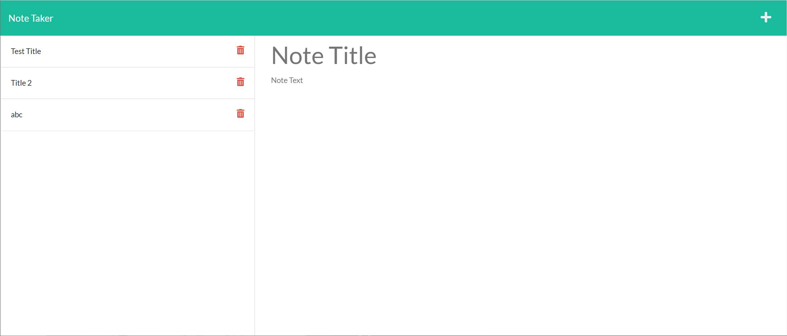

# Note Taker Starter Code

## Result

GitHub repository : https://github.com/pc611652003/Note-Taker

Application : https://watch.screencastify.com/v/V4qUXbPNTaO1Eud6akdk

Once user open the Note Taker, user will land on a page with a link to notes page.

After user click on the link, user will land on the notes page, with existing notes display on the left, and a new note is ready on the right.

After user type in the note title and note text, the save icon will show up.

After saved, the new note will show on the left.

After user click the delete button on the left, the corresponding note will be deleted.
